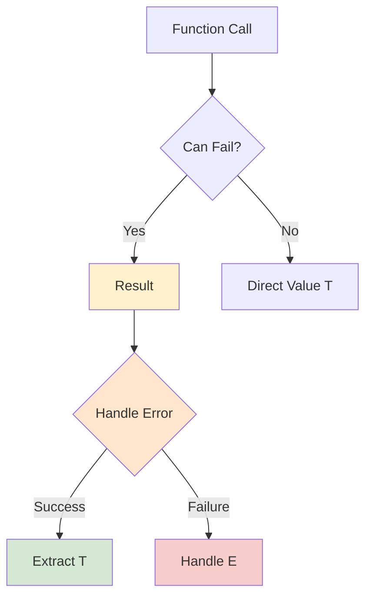
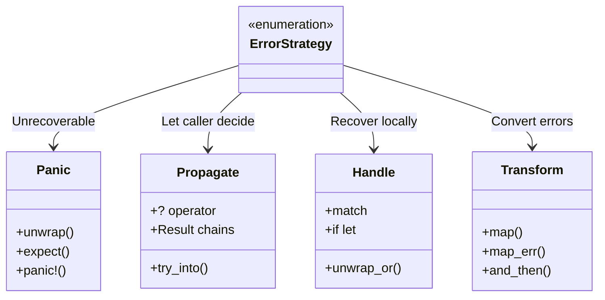
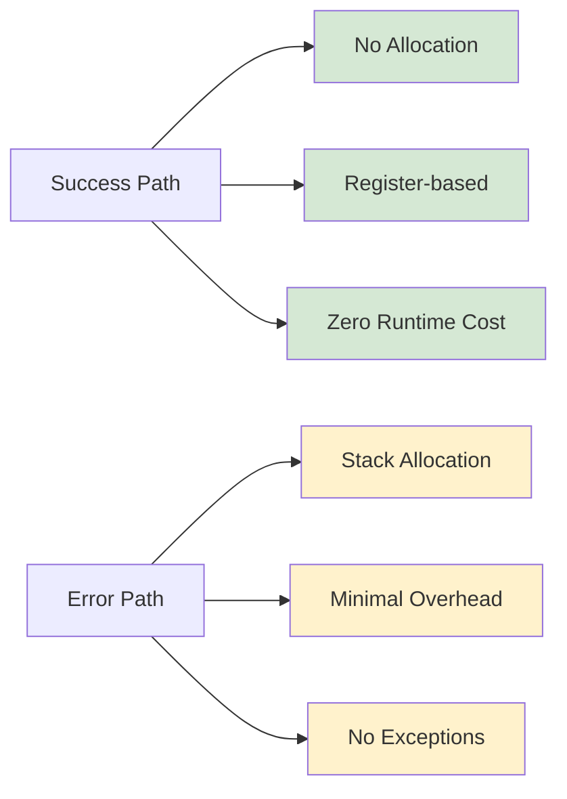

# Complete Guide to Rust Error Handling with Visual Examples

Error handling in Rust is fundamentally different from other languages. Instead of exceptions, Rust uses types like `Result<T, E>` and `Option<T>` to represent potential failures. This approach makes errors explicit and forces developers to handle them properly[^1].

## The Error Handling Philosophy

Rust's approach to error handling is based on making errors visible in the type system:



This diagram shows how Rust's type system makes error handling explicit and mandatory.

## The Result<T, E> Type

The `Result` type is Rust's primary tool for recoverable errors. Here's how it works:

```rust
// Basic Result usage
fn divide(a: f64, b: f64) -> Result<f64, String> {
    if b == 0.0 {
        Err("Cannot divide by zero".to_string())
    } else {
        Ok(a / b)
    }
}

fn main() {
    match divide(10.0, 2.0) {
        Ok(result) => println!("Result: {}", result),
        Err(error) => println!("Error: {}", error),
    }
}
```

As we discussed in [[rust-type-system-fundamentals]], the type system ensures you can't ignore potential errors.

## The Option<T> Type

`Option<T>` handles cases where a value might be absent:

```rust
fn find_user(id: u32) -> Option<User> {
    // Simulate database lookup
    if id == 1 {
        Some(User { 
            id, 
            name: "Alice".to_string() 
        })
    } else {
        None
    }
}

fn main() {
    match find_user(1) {
        Some(user) => println!("Found user: {}", user.name),
        None => println!("User not found"),
    }
}
```

## Error Propagation Patterns

Rust provides several patterns for propagating errors through your call stack:


### The ? Operator

The `?` operator is Rust's primary tool for error propagation:

```rust
use std::fs::File;
use std::io::{self, Read};

fn read_file_contents(path: &str) -> Result<String, io::Error> {
    let mut file = File::open(path)?; // Propagates error if file doesn't exist
    let mut contents = String::new();
    file.read_to_string(&mut contents)?; // Propagates error if read fails
    Ok(contents)
}

// Equivalent without ? operator (more verbose)
fn read_file_contents_verbose(path: &str) -> Result<String, io::Error> {
    let mut file = match File::open(path) {
        Ok(file) => file,
        Err(error) => return Err(error),
    };
    
    let mut contents = String::new();
    match file.read_to_string(&mut contents) {
        Ok(_) => Ok(contents),
        Err(error) => Err(error),
    }
}
```

## Custom Error Types

For complex applications, you'll want to create custom error types. Here's a comprehensive approach:

```rust
use std::fmt;
use std::error::Error;

#[derive(Debug)]
enum AppError {
    Io(std::io::Error),
    Parse(std::num::ParseIntError),
    Custom(String),
}

impl fmt::Display for AppError {
    fn fmt(&self, f: &mut fmt::Formatter) -> fmt::Result {
        match self {
            AppError::Io(err) => write!(f, "IO error: {}", err),
            AppError::Parse(err) => write!(f, "Parse error: {}", err),
            AppError::Custom(msg) => write!(f, "Application error: {}", msg),
        }
    }
}

impl Error for AppError {
    fn source(&self) -> Option<&(dyn Error + 'static)> {
        match self {
            AppError::Io(err) => Some(err),
            AppError::Parse(err) => Some(err),
            AppError::Custom(_) => None,
        }
    }
}

// Implement From for automatic conversion
impl From<std::io::Error> for AppError {
    fn from(error: std::io::Error) -> Self {
        AppError::Io(error)
    }
}

impl From<std::num::ParseIntError> for AppError {
    fn from(error: std::num::ParseIntError) -> Self {
        AppError::Parse(error)
    }
}
```

This pattern allows you to use the `?` operator with different error types seamlessly.

## Error Handling Strategies

Here are the main strategies for handling errors in Rust:



### Strategy 1: Panic for Unrecoverable Errors

```rust
fn main() {
    let config = std::fs::read_to_string("config.toml")
        .expect("Config file is required for application to run");
    
    // If config file doesn't exist, the application should crash
    println!("Config loaded: {}", config);
}
```

### Strategy 2: Graceful Error Handling

```rust
fn process_user_input(input: &str) -> Result<i32, AppError> {
    let number: i32 = input.trim().parse()?;
    
    if number < 0 {
        return Err(AppError::Custom("Number must be positive".to_string()));
    }
    
    Ok(number * 2)
}

fn main() {
    match process_user_input("42") {
        Ok(result) => println!("Processed: {}", result),
        Err(error) => {
            eprintln!("Error processing input: {}", error);
            // Could log, retry, or provide default value
        }
    }
}
```

### Strategy 3: Chaining Operations

```rust
fn process_data(data: &str) -> Result<String, AppError> {
    data.trim()
        .parse::<i32>()?                    // Parse to integer
        .checked_mul(2)                     // Safe multiplication
        .ok_or_else(|| AppError::Custom("Overflow".to_string()))?
        .to_string()                        // Convert back to string
        .chars()
        .rev()
        .collect::<String>()                // Reverse the string
        .parse::<i32>()                     // Parse reversed string
        .map(|n| format!("Final: {}", n))   // Format result
        .map_err(|e| e.into())              // Convert error type
}
```

## Advanced Error Handling Patterns

### Using the `anyhow` Crate

For applications (not libraries), consider using the `anyhow` crate for simpler error handling:

```rust
use anyhow::{Context, Result};

fn complex_operation() -> Result<String> {
    let file_content = std::fs::read_to_string("data.txt")
        .context("Failed to read data file")?;
    
    let parsed_number: i32 = file_content.trim().parse()
        .context("File content is not a valid number")?;
    
    if parsed_number < 0 {
        anyhow::bail!("Number must be positive, got: {}", parsed_number);
    }
    
    Ok(format!("Processed: {}", parsed_number * 2))
}
```

### Error Recovery Patterns

Sometimes you want to try multiple approaches before giving up:

```rust
fn try_multiple_sources() -> Result<String, AppError> {
    // Try primary source
    if let Ok(data) = read_from_primary() {
        return Ok(data);
    }
    
    // Try backup source
    if let Ok(data) = read_from_backup() {
        return Ok(data);
    }
    
    // Try default source
    read_from_default()
        .or_else(|_| Ok("Default value".to_string()))
}

fn read_from_primary() -> Result<String, AppError> {
    std::fs::read_to_string("primary.txt").map_err(Into::into)
}

fn read_from_backup() -> Result<String, AppError> {
    std::fs::read_to_string("backup.txt").map_err(Into::into)
}

fn read_from_default() -> Result<String, AppError> {
    std::fs::read_to_string("default.txt").map_err(Into::into)
}
```

## Error Handling in Async Code

When working with async code, error handling patterns remain similar but with some considerations for [[async-rust-fundamentals]]:

```rust
use tokio;

async fn fetch_user_data(id: u32) -> Result<User, AppError> {
    let response = reqwest::get(&format!("https://api.example.com/users/{}", id))
        .await
        .context("Failed to make HTTP request")?;
    
    if !response.status().is_success() {
        return Err(AppError::Custom(format!(
            "HTTP error: {}", response.status()
        )));
    }
    
    let user: User = response.json()
        .await
        .context("Failed to parse JSON response")?;
    
    Ok(user)
}

#[tokio::main]
async fn main() -> Result<(), AppError> {
    match fetch_user_data(1).await {
        Ok(user) => println!("User: {:?}", user),
        Err(error) => {
            eprintln!("Failed to fetch user: {}", error);
            // Could implement retry logic here
        }
    }
    Ok(())
}
```

## Testing Error Conditions

Testing error paths is crucial for robust applications:

```rust
#[cfg(test)]
mod tests {
    use super::*;

    #[test]
    fn test_divide_by_zero() {
        let result = divide(10.0, 0.0);
        assert!(result.is_err());
        
        if let Err(error) = result {
            assert_eq!(error, "Cannot divide by zero");
        }
    }

    #[test]
    fn test_successful_division() {
        let result = divide(10.0, 2.0);
        assert!(result.is_ok());
        assert_eq!(result.unwrap(), 5.0);
    }

    #[test]
    fn test_error_propagation() {
        // Test that errors bubble up correctly
        let result = process_user_input("not_a_number");
        assert!(result.is_err());
        
        match result {
            Err(AppError::Parse(_)) => {}, // Expected
            _ => panic!("Expected parse error"),
        }
    }
}
```

## Performance Considerations

Rust's error handling is zero-cost when no errors occur[^2]. The `Result` type is optimized and doesn't allocate heap memory:



Here's a performance comparison:

```rust
use std::time::Instant;

fn benchmark_error_handling() {
    let start = Instant::now();
    
    // Success case - should be extremely fast
    for i in 0..1_000_000 {
        let result: Result<i32, &str> = Ok(i);
        match result {
            Ok(val) => { let _ = val * 2; },
            Err(_) => {},
        }
    }
    
    println!("Success path: {:?}", start.elapsed());
    
    let start = Instant::now();
    
    // Error case - still fast, no exceptions
    for i in 0..1_000_000 {
        let result: Result<i32, &str> = Err("error");
        match result {
            Ok(_) => {},
            Err(_) => { /* handle error */ },
        }
    }
    
    println!("Error path: {:?}", start.elapsed());
}
```

## Best Practices Summary

1. **Use `Result<T, E>` for recoverable errors**
2. **Use `Option<T>` for optional values**
3. **Create custom error types for complex applications**
4. **Use the `?` operator for error propagation**
5. **Prefer explicit error handling over panicking**
6. **Test both success and error paths**
7. **Consider using `anyhow` for application error handling**
8. **Use `thiserror` for library error types**

## Common Pitfalls

### Pitfall 1: Overusing `unwrap()`

```rust
// ❌ Bad: Will panic if file doesn't exist
let content = std::fs::read_to_string("file.txt").unwrap();

// ✅ Good: Handle the error appropriately  
let content = match std::fs::read_to_string("file.txt") {
    Ok(content) => content,
    Err(error) => {
        eprintln!("Failed to read file: {}", error);
        return;
    }
};
```

### Pitfall 2: Ignoring Error Context

```rust
// ❌ Bad: Loses error context
fn process_file(path: &str) -> Result<String, Box<dyn std::error::Error>> {
    let content = std::fs::read_to_string(path)?;
    let number: i32 = content.trim().parse()?;
    Ok(format!("Number: {}", number))
}

// ✅ Good: Preserves error context
fn process_file_better(path: &str) -> Result<String, AppError> {
    let content = std::fs::read_to_string(path)
        .map_err(|e| AppError::Io(e))?;
    let number: i32 = content.trim().parse()
        .map_err(|e| AppError::Parse(e))?;
    Ok(format!("Number: {}", number))
}
```

## Conclusion

Rust's error handling system might seem verbose at first, but it provides several key benefits:

- **Explicit**: Errors are visible in function signatures
- **Safe**: Can't accidentally ignore errors
- **Fast**: Zero-cost when no errors occur
- **Composable**: Easy to chain and transform errors

By mastering these patterns, you'll write more robust and maintainable Rust code. For more advanced patterns, see [[advanced-rust-error-handling]] and [[rust-error-handling-async]].

The key is to embrace Rust's philosophy: make errors explicit, handle them appropriately, and let the type system guide you toward robust code.

---

### References

[^1]: Unlike languages with exceptions (Java, C#, Python), Rust makes error handling explicit through the type system. This prevents the common issue of unhandled exceptions causing runtime crashes.

[^2]: Rust's `Result<T, E>` is implemented as a tagged union that's optimized by LLVM. In the success case, it's essentially a direct value with no additional overhead compared to languages with exceptions.
